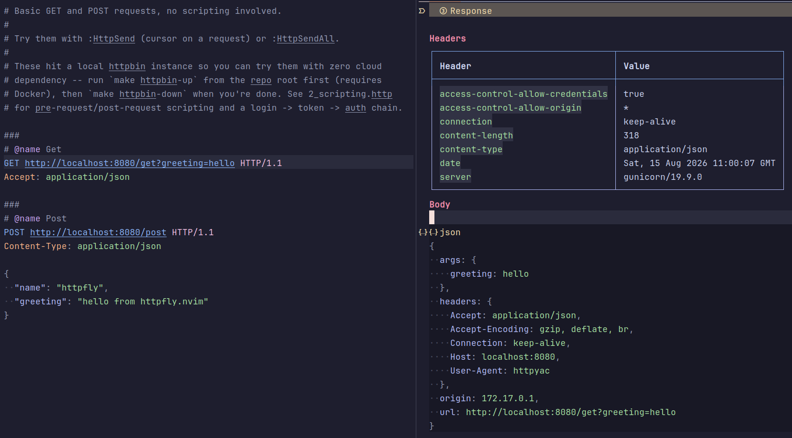

# httpfly.nvim

Send `.http` requests from Neovim using
[httpfly](https://github.com/cristianradulescu/httpfly) and view the
response as readable markdown.



> **New here?** Check out `doc/examples/` for runnable `.http` files
> covering everything below, from basic requests to scripting.

## Scope

This plugin does **not** implement request execution, variables, or
scripting itself — [httpfly](https://github.com/cristianradulescu/httpfly)
does that. This plugin just wires it into Neovim:

- discovers/selects the httpfly environment (`httpfly.env.json`) for the
  current file
- runs `httpfly run` on the request under your cursor (or the whole file)
- formats the JSON result as markdown (request/response headers, bodies
  pretty-printed when JSON, status line) in a split
- lets you preview values that got truncated in header tables (e.g. long
  bearer tokens) in a floating window
- saves a copy of every result under `.httpfly/history/`

If you need JetBrains HTTP Client-style syntax (`###` separators,
`{{variables}}`, `< `/`> ` Lua pre/post-request scripts,
`httpfly.env.json` environments), that comes from httpfly — this plugin
doesn't reimplement or restrict any of it.

See `doc/examples/` for runnable `.http` files: `1_basic.http` (plain
GET/POST), `2_scripting.http` (pre-/post-request scripting, including a
login → token → authenticated-request chain), `3_environments.http` (uses
`{{base_url}}`/`{{client_name}}` from the `httpfly.env.json` in that same
directory — pick an environment with `:HttpEnv` first), `4_shell_auth.http`
(a pre-request script shelling out to `generate-token.sh` and using its
stdout as the request's token — for auth flows too complex to reimplement
inline), `5_forms.http` (`application/x-www-form-urlencoded` and
`multipart/form-data`), and `6_save_response.http` (a post-request script
saving a JSON/text response body to `/tmp` for its own sake — a
snapshot/fixture, not a file the server means for you to download). They
hit a local httpbin instance — run `make httpbin-up` first (requires
Docker), `make httpbin-down` when done.

## Requirements

- Neovim 0.10+
- [httpfly](https://github.com/cristianradulescu/httpfly) on your `$PATH`:
  ```sh
  go install github.com/cristianradulescu/httpfly/cmd/httpfly@latest
  ```
  (or build it from source — see httpfly's own `doc/installation.md`)

## Setup

With [lazy.nvim](https://github.com/folke/lazy.nvim):

```lua
{
  "cristianradulescu/httpfly.nvim",
  ft = "http",
  opts = {},
}
```

Calling `require("httpfly").setup({})` (or passing `opts = {}` above) isn't
required — all options have defaults — but it's the way to override them:

```lua
require("httpfly").setup({
  cmd = "httpfly",               -- httpfly binary/command to run
  env_file = "httpfly.env.json", -- environment file name to look for
  keymaps = true,                -- set the default <leader>h* keymaps below
  max_header_value_len = 100,    -- header table cell truncation length
  preview_keymap = "K",          -- keymap to preview a truncated value
  output_style = "markdown",     -- "markdown" or "unicode"
})
```

## Usage

Open a `.http` file and:

| Command         | Keymap        | Does                                                |
|-----------------|---------------|------------------------------------------------------|
| `:HttpEnv`      | `<leader>he`  | Pick the httpfly environment for this file            |
| `:HttpEnv dev`  | —             | Set the environment directly, without the picker      |
| `:HttpEnvVars`  | `<leader>hv`  | Show the selected environment's merged variables       |
| `:HttpSend`     | `<leader>hs`  | Send the request under the cursor                     |
| `:HttpSendAll`  | `<leader>ha`  | Send every request in the file                        |
| `:HttpSessionClear` | `<leader>hc` | Clear persisted `client.global` state (see below) |

The response opens in a vertical split as markdown (`filetype = "markdown"`).
Set `output_style = "unicode"` for the same layout (headers as a table,
request/response sections, a body block) rendered with Unicode box-drawing
characters (`┌─┬─┐`, `━━━`) instead of markdown syntax — no `**bold**`,
`` ``` `` fences, or `|---|` pipes, `filetype = "text"`. It's colored too
(status/method/section titles/JSON body syntax — keys, strings, numbers,
booleans, null/etc.), via highlights the plugin applies directly to the
buffer — no markdown-rendering plugin or treesitter parser needed. Useful
if you don't want a markdown-rendering plugin touching this
buffer, or just prefer that look. History files (see below) get `.txt`
instead of `.md` to match. In that split, put the
cursor on a truncated header value and press `K` to see the full value in a
floating window (works the same in both styles).

The currently selected environment for the file is shown in the winbar
(`env: dev`, or `env: (none, :HttpEnv)` before you've picked one).

### Environments

`:HttpEnv` looks for `httpfly.env.json` directly in the current file's own
directory (httpfly resolves it relative to its own process cwd, with no
upward search — see "Directory resolution" below), and lists the keys under
its `"environments"` object as choices:

```json
{
  "shared": {
    "client_name": "my-app"
  },
  "environments": {
    "dev": { "base_url": "https://dev.example.com" },
    "prod": { "base_url": "https://api.example.com" }
  }
}
```

`"shared"` is merged as defaults into every environment (overridden by that
environment's own values on conflict) — it's not itself a selectable
environment. Unlike some other HTTP-file tools, there's no separate
"private" env file split for secrets; if you need to keep values out of
version control, `.gitignore` the whole `httpfly.env.json` (or a
project-specific copy of it).

The selected environment is remembered per env-file, so different projects
don't interfere with each other. Run `:HttpEnvVars` any time to see exactly
which values are in effect for the selected environment (shared + env, then
persisted `client.global` state — see below — overriding those, the same
order httpfly itself applies when sending requests). Variables added or
overridden by persisted state are marked `[session]` / `[overridden by
session]`.

### Directory resolution

httpfly resolves `httpfly.env.json` and `.httpfly/state.json` relative to
its own process's **current working directory only** — there's no upward
directory search. This plugin always runs it with `cwd` set to the `.http`
file's own directory, so `httpfly.env.json` needs to live right next to
whichever `.http` files use it (a project with `.http` files nested below
where the env file lives needs its own copy per directory).

### Chaining requests across separate sends

`client.global:set(...)` in a Lua script writes straight through to
`.httpfly/state.json`, immediately — not just at the end of a run. httpfly
does this natively, so a value one request's post-request script sets is
picked up by a later request in the same `:HttpSendAll`, and by any request
in a later, separate `:HttpSend` — no plugin hook or extra configuration
needed on this plugin's side. Run `:HttpSessionClear` to delete the state
file (e.g. once a token expires).

### Scripting notes

Scripts are Lua (`< ` pre-request, `> ` post-request) —
the only language httpfly currently supports. `response.body` is always the
raw response text, whatever its `Content-Type`; decode it yourself with
`json.decode(response.body)` when it's JSON. There's no per-request
"local variable" API for a pre-request script — the only mutable store a
script can reach is the persisted `client.global`, so even a value meant to
be used only within the current request has to go through it.

### History

Every successfully rendered response is also saved to `.httpfly/history/`
next to the `.http` file's own directory (the same directory httpfly's own
`.httpfly/state.json` lives in), named by timestamp
(`YYYYMMDD-HHMMSS-microseconds.md`).

### Gitignore

Both the persisted state file and history live under a single `.httpfly/`
directory next to your env file, so ignoring the whole thing covers both
(and the state file can hold captured secrets, so this is worth doing):

```
.httpfly/
```
